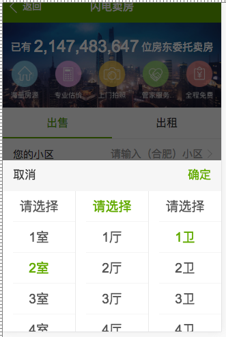
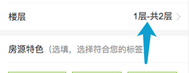
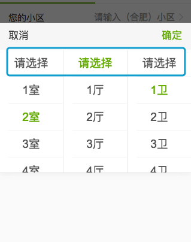

# 用于模拟select的多项下拉选取的组件
* `User_Touch_Module_MultiSlterComponent`
* 依赖 iscroll[-lite]、Zepto、{MultiSlter.css}
* 组件内部的`html`节点全都由`js`生成
* 可以同时配置多个`selecter`，类似原生日期选择器
* 数据自动代入、带出。`openSlter`节点的`html`内容和`selecter`选择器的内容始终对应，开、关组件时字段自动设置
* 点击确认后可根据`配置`将数据自动代入到`@openSlter`节点或者执行传入的回调
* 注册全局对象：window.MultiSlter，并挂载了两个常用方法



## 初始化

* 因为`input`元素可输入状态下会触发键盘弹出，`disable`状态无法绑定事件，`readonly`状态同样会触发`iOS`的键盘弹出事件，所以推荐使用被设置为`inline-block`的元素来初始化一个`MultiSlter`实例
* 考虑到渲染时机，请按需将`class` `multislter-holder`添加到`@openSlter`节点上

```
<!-- html -->
<li>
    <label>户型</label>
    <input type="hidden" name="rooms">
    <input type="hidden" name="livings">
    <input type="hidden" name="toilets">
    <span class="multislter-holder" id="houseTypeSlter">请选择您的户型</span>
</li>
```

```
// js
var houseTypeSlterData = [MultiSlter.getSlterData(1, 9, "", "室"), MultiSlter.getSlterData(1, 9, "", "厅"), MultiSlter.getSlterData(1, 9, "", "卫")];
var houseTypeSlter = new ajk.module.MultiSlter({
    openSlter : "#houseTypeSlter",
    datas : houseTypeSlterData
});
```

## options

### op.datas：数据源
* 必需传入，作为选择器的数据
* 数据的格式（在控制台执行：`[MultiSlter.getSlterData(1, 9, "", "室"), MultiSlter.getSlterData(1, 9, "", "厅"), MultiSlter.getSlterData(1, 9, "", "卫")];
`即可得到以下格式化后的数据）：

```
[
    [{"htmlData":"1室","value":1},{"htmlData":"2室","value":2},{"htmlData":"3室","value":3},{"htmlData":"4室","value":4},{"htmlData":"5室","value":5},{"htmlData":"6室","value":6},{"htmlData":"7室","value":7},{"htmlData":"8室","value":8},{"htmlData":"9室","value":9}],
    [{"htmlData":"1厅","value":1},{"htmlData":"2厅","value":2},{"htmlData":"3厅","value":3},{"htmlData":"4厅","value":4},{"htmlData":"5厅","value":5},{"htmlData":"6厅","value":6},{"htmlData":"7厅","value":7},{"htmlData":"8厅","value":8},{"htmlData":"9厅","value":9}],
    [{"htmlData":"1卫","value":1},{"htmlData":"2卫","value":2},{"htmlData":"3卫","value":3},{"htmlData":"4卫","value":4},{"htmlData":"5卫","value":5},{"htmlData":"6卫","value":6},{"htmlData":"7卫","value":7},{"htmlData":"8卫","value":8},{"htmlData":"9卫","value":9}]
]
```
* 上述`{"htmlData":"1室","value":1}`等对象中，`htmlData`字段将作为`li`节点的`html`内容，为必需的；对象中的其它字段会被拼到`li`节点的`data-`属性节点中，为非必需

### op.separator：自定义连接符
* `必须`传入，最少也要传入空格`" "`，因为刚进入页面时`@openSlter`节点内可能有默认的`html`（比如`1层-共2层`）
* 默认值为英文格式的`-`
* 用来分隔多个`select`，如图：



### op.sltedClassName
* 被选中`li`节点的`className`

### op.cancleTip:自定义提示信息



### 模拟`placeholder`
* 在`html`中设置，当`@openSlter`节点上有`data-holder`时，组件会自动进行模拟`placeholder`：

```
<span class="multislter-holder" id="houseTypeSlter" data-holder="请选择您的户型">请选择您的户型</span>
```

* ⚠️注意：当`@openSlter`节点上没有`data-holder`字段时，会将其`innerHTML`字段作为`placeholder`进行模拟！

### op.slideDownInterval
* 组件关闭时`下滑`动画时长
* 默认为`0`，无下滑动画，因为有动画时遮罩层的`突然消失`体验不好

### op.autoScrollInterval
* 打开组件时，内部的`selecter`自动滚动到与`@openSlter`内容相应的位置的动画时长
* 设为`0`可以提升性能


### op.cancleCallback
* 点击`取消`按钮时执行
* args: (sltedLiAry, self)
> sltedLiAry: 被选中的`li`组成的`DOM数组`。
> self: MultiSlter对象

### op.confirmCallback
* 点击`确认`按钮时执行
* args: (sltedLiAry, self)
> sltedLiAry: 被选中的`li`组成的`DOM数组`。
> self: MultiSlter对象
* 可以用其返回值设置是否在点击确认后自动隐藏组件及是否自动将选择内容填充回`openSlter`节点：

```
var floorSlter = new ajk.module.MultiSlter({
    openSlter : "#floorSlter",
    datas : floorSlterData,
    confirmCallback : function( sltedNodeAry, multiSlterObj ) {

        // 点击确定后执行自动隐藏，但是不将内容自动填入`openSlter`节点
        return {
            autoInster : false,
            autoHide : true     // 为`true`的可省略
        };
    }
});
```


### op.liTapCallback
* 点击`li`节点按钮时执行
* 会执行`iscroll`的`tap`事件，而不是`click`事件
* args: (thisLiNode, scroller, sltedAry, scroller)
> thisLiNode : 点击的`DOM对象`。  
> ulItem     : 此`li`所在的`ul` `DOM`对象。  
> sltedAry   : 当前选中的所有`li`对象数组  
> scroller   : `MultiSlter`对象。 
> allScrollers : 当前下拉控件的所有`slroller`组成的数组 
* `return false`时 : 阻止默认选中`li`元素的操作

## 实例方法

### 显示
* show

### 隐藏
* hide

## window.MultiSlter对象的方法

### window.MultiSlter.getSlterData(from, to, pre, after)

* 用于生成初始化`MultiSlter`对象的`datas`
* 生成`连续`的数据
* 举例`MultiSlter.getSlterData(1, 3, "共", "层")`将会得到：

```
[
    {
        "htmlData":"共1层",
        "value":1
    },
    {
        "htmlData":"共2层",
        "value":2
    },
    {
        "htmlData":"共3层",
        "value":3
    }
]
```


### window.MultiSlter.setSltedIptVal(nameAry, sltedLiAry)
* 自动填充 `[name={xx}]`的`input`元素
* 当使用`<input type="hidden" name="user_name">` `隐藏域`保存表单数据时，需要根据从`MultiSlter`中选择的结果填充`隐藏域`，可调用以下方法方便的将选择结果填进`隐藏域`：

```
var floorSlter = new ajk.module.MultiSlter({
    openSlter : "#floorSlter",
    datas : floorSlterData,
    confirmCallback : function( sltedLiAry, multiSlterObj ) {

        // 填上hidden的内容
        MultiSlter.setSltedIptVal(["pro_floor", "floor"], sltedLiAry);
    }
});
```