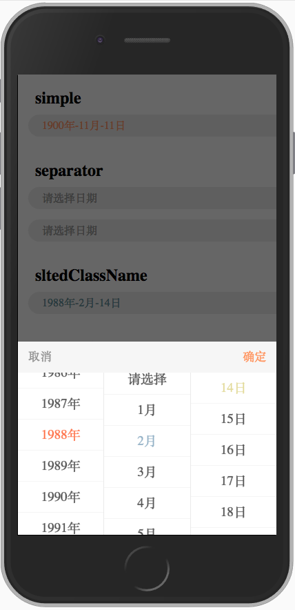

# 移动端模拟select的控件

> 依赖 iscroll[-lite]、Zepto  
> 注册全局对象：window.MultiSlter

## 简单实例
```
new MultiSlter({
    openSlter : "#slter",
    datas : [
        [{htmlData:"1",value:1}, {htmlData:"2",value:2}, {htmlData:"3",value:3}, {htmlData:"4",value:4}]
    ]
            
});
```



## 可选参数

|参数名|参数类型|参数意义|
|---|---|---|
|datas|[{htmlData:"1"}, {htmlData:"2"}]|`select`内的`option`数据|
|separator|string|连接符|
|sltedClassName|string|被选中`li`的`className`|
|cancleTip|string|最顶部`li`节点的内容|
|slideDownInterval|int|组件关闭时`下滑`动画时长。默认为`0`，无下滑动画|
|autoScrollInterval|int|打开组件时，滚到已选`li`节点的动画时长|

## 可选回调
|回调函数名称|参数|意义|return|
|---|---|---|---|
|cancleCallback|(sltedLiAry, slterObj)，sltedLiAry: 被选中的`li`组成的`DOM数组`；slterObj: MultiSlter对象|点击取消时执行|--|
|confirmCallback|(sltedLiAry, slterObj)，sltedLiAry: 被选中的`li`组成的`DOM数组`；slterObj: MultiSlter对象|点击确认时执行|{autoInster : false, autoHide : true }|
|liTapCallback|(thisLiNode, ulItem, sltedAry, scroller, allScrollers)，thisLiNode : 点击的`DOM对象`，ulItem : 此`li`所在的`ul` `DOM`对象，sltedAry : 当前选中的所有`li`对象数组，scroller : `MultiSlter`对象，allScrollers : 当前下拉控件的所有`slroller`组成的数组|`tap` `li`时执行|false:阻止默认选中`li`元素的操作|


### 模拟`placeholder`
* 给`@openSlter`节点添加`data-holder`属性，组件会自动模拟`placeholder`，当`@openSlter`节点上没有`data-holder`字段时，会将其`innerHTML`字段作为`placeholder`进行模拟：

```
<span class="multislter-holder" id="houseTypeSlter" data-holder="请选择您的户型">请选择</span>
```

## 实例方法

|方法名|作用|
|---|---|
|show|显示控件|
|hide|隐藏控件|

## 静态方法：window.MultiSlter.getSlterData(from, to, pre, after, subk, subv)

> `window.MultiSlter.getSlterData`方法用于方便地生成用于初始化`MultiSlter`对象的`datas`数据。此方法生成的数据是`连续`的。例如执行`MultiSlter.getSlterData(1, 3, "共", "天", "name", "date")`将会得到：

```
[
    {htmlData:"共1天","value":1,"name":"date"},
    {htmlData:"共2天","value":2,"name":"date"},
    {htmlData:"共3天","value":3,"name":"date"}
]
```