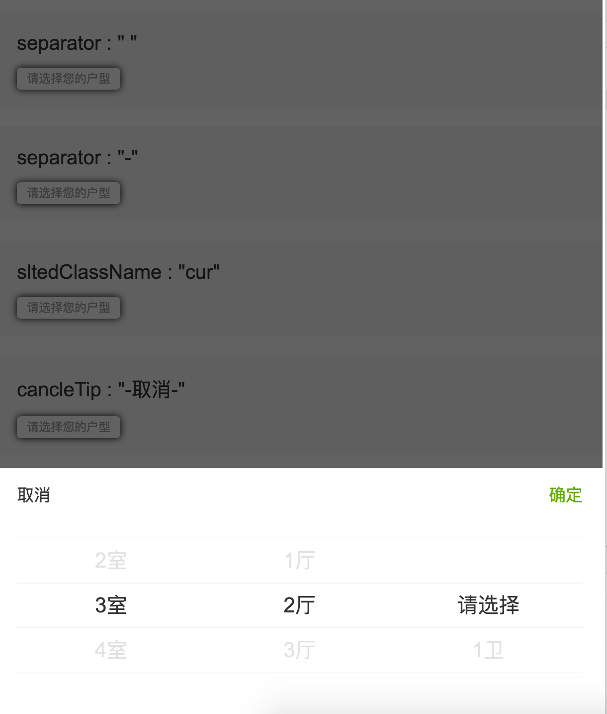

# 模拟select的选择器
## demos:
[demo](https://github.com/narutowyh/multiSlter/tree/master/demos)  

## 依赖
1. [Zepto](http://zeptojs.com/)
2. [iscroll](https://github.com/cubiq/iscroll)

## Initialization  
## options  
### options.cancleTip  
li顶层的文案
### options.separator  
分隔符
### options.sltedClassName  
被选中的li节点的class name
### options.openSlter  
用于打开组件的css选择器
### options.datas  
用于生成option的数组，格式：

```
[
  [{
    htmlData : "1月", // 会被添加到li节点的html里，必须
    sub : "1" // 会被添加到li节点的`data-`里，可选
  }, {
    htmlData : "2月",
    sub : "2"
  }, {
    htmlData : "3月",
    sub : "3"
  }],
  [{
    htmlData : "1日",
    sub : "1"
  }, {
    htmlData : "2日",
    sub : "2"
  }, {
    htmlData : "3日",
    sub : "3"
  }]
]
```
### options.liTapCallback  
liTapCallback( selectedLi, thisScroller, multiSlterObj )  
点击li节点的回调  
`@selectedLi `: 被点击的li节点的引用  
`@thisScroller `: 点击的li所在的scroller对象的引用  
`@multiSlterObj `: 整个组件对象的引用
### options.cancleCallback  
cancleCallback( sltedNodeAry, multiSlterObj )   
点击取消的回调
`@sltedNodeAry`: 被选中的li节点组成的数组  
`@multiSlterObj`:整个组件对象的引用  
### options.confirmCallback  
confirmCallback( sltedNodeAry, multiSlterObj )   
点击成功的回调  
参数同上
